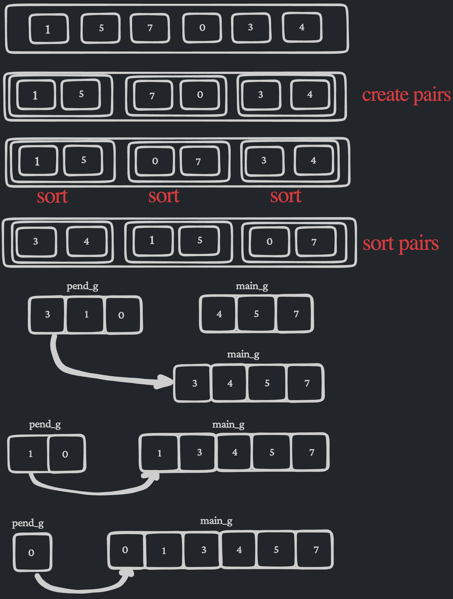

<h1>ex00: Bitcoin Exchange</h1>

### *requirements*
- #### read and store data 
    - **(1)** read files data.csv and input.csv
    - **(2)** store the data of data.csv file in a map continer

- #### check format in input.txt file and calcule btc_value
    - **(1)** check if date are valid
    - **(2)** check if btc_value are valid
    - **(3)** search about the date in data.csv
    - **(4)** display the result as required

___

<h1>ex01: RPN</h1>

### *requirements*
- #### store input
    - **(1)** check if the input are valid
    - **(2)** store input in a stack container

- #### do the operations
    - **(1)** check if the input represent a operation
    - **(2)** read the tow top numbers of stack
    - **(3)** do the operation over the tow numbers
    - **(4)** check that the programe work as a RPN system

### References
[Reverse-Polish-Notation](https://www.dcode.fr/reverse-polish-notation?__r=1.47a10a0cb29e5529e8787275128f0dcd)

<h1>ex02:  PmergeMe</h1>

- ### ford-johnson sorting algorithm
    **asume that we have a set of integers `X` with size `n`**
    - **(1)** splet `X` to pairs groups 
    - **(2)** sort each pairs to `[less,greater]`
    - **(3)** Recursively sort the pairs by the graeter elements using insertion sort algorithm
    - **(4)** create tow groups one contain the larger elements named `main_g` and other one contain the smallest elements named `pend_g`
    - **(5)** insert the elenemts of `pend_g` into `main_g` exact in ther position

### References
- [Wikipedia-Merge-Insertion-Sort](https://en.wikipedia.org/wiki/Merge-insertion_sort)
- [CodeReview-ford-johnson-merge-insertion-sort](https://codereview.stackexchange.com/questions/116367/ford-johnson-merge-insertion-sort)
- [merge-insertion-sort](https://github.com/decidedlyso/merge-insertion-sort/blob/master/README.md)

### diagram
